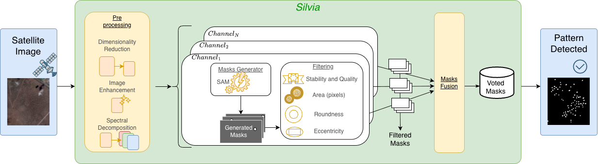

# SILVIA

<h1 align="center">SILVIA
  <br/>
  <sub>Segmentation and Identification for satelLite Vegetation pattern ImAges</sub>
</h1>

<p align="center">
  <a href="https://python.org"></a>
  
  <a href="https://github.com/facebookresearch/segment-anything"></a>
  <a href="https://github.com/Ste-lla02/silvia/stargazers"></a>
</p>

<p align="center">
  
</p>

**SILVIA** (Segmentation and Identification for satelLite Vegetation pattern ImAges) is a modular image segmentation pipeline designed for the detection and analysis of vegetation patterns in high-resolution satellite imagery.

The framework integrates the Segment Anything Model (SAM) with domain-specific preprocessing, geometric filtering, and multi-channel mask fusion techniques to support robust and reproducible environmental analysis.

---

## Motivation

Vegetation patterns such as fairy circles, gaps, rings, and clustered structures are important indicators of ecosystem dynamics, soil conditions, and environmental stress in arid and semi-arid regions.  
However, automated detection of these patterns from satellite imagery remains challenging due to:

- heterogeneous image sources and resolutions,
- absence of labelled datasets,
- sensitivity to noise (e.g., clouds, shadows),
- variability in vegetation appearance.

SILVIA addresses these challenges by combining **foundation-model-based segmentation** with **pre- and post-processing, and fusion strategies**, without requiring supervised training.

---

## Main Features

- **SAM-based segmentation**  
  Automatic generation of segmentation masks without task-specific training.

- **Multi-representation processing**
  - RGB satellite images,
  - individual spectral channels,
  - vegetation index–derived images (e.g. ExG, NDVI when available).

- **Configurable geometric filtering**
  - area constraints,
  - roundness,
  - eccentricity,
  - segmentation stability and quality scores.

- **Multi-channel mask fusion**
  Voting-based mechanisms to:
  - reduce false positives (FP),
  - reduce false negatives (FN),  
  depending on the selected fusion policy.

- **Research-oriented and extensible**  
  Designed to support experimentation, reproducibility, and adaptation to different domains.

---

## Pipeline Overview

The SILVIA pipeline is structured into four main stages:

1. **Preprocessing**
   - image resizing and tiling,
   - spectral decomposition and vegetation index computation,
   - optional enhancement filters.

2. **Mask Generation**
   - application of SAM to each image representation,
   - extraction of geometric and quality attributes.

3. **Filtering**
   - removal of low-quality or geometrically inconsistent masks.

4. **Channel Fusion**
   - voting-based fusion of masks obtained from different channels.

---

## Installation

```bash
git clone https://github.com/Ste-lla02/silvia.git
cd silvia
pip install -r requirements.txt
